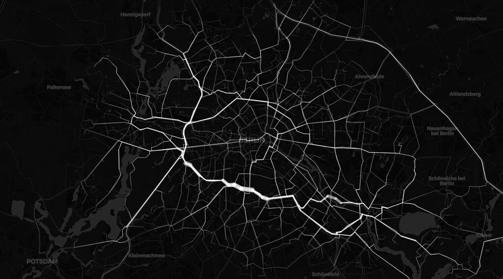

#### rOpenSci package or resource used*
[stplanr](https://docs.ropensci.org/stplanr) package

#### What did you do? 

*The life lines of Berlin*

A fast way to find major streets within a city, without searching for any data on traffic amounts, street types or street width:

Take random start and end points within the city and run a routing to find routes connecting the start and end points.

Then aggregate the single street segments on how often they were used. You then get an image of the major city axes.


#### URL or code snippet for your use case*
[Map](https://alexandrakapp.github.io/30daymapchallenge/html/day9.html)
[Code](https://github.com/AlexandraKapp/30daymapchallenge/blob/e0355a0aa909371416377b99df82cc948e51d592/R/day9.R)

```R
library(sf)
library(dplyr)
library(osrm)
library(stplanr)
library(leaflet)

# get 500 random routings

berlin <- st_read("data/berlin_bz.geojson")

start_points <- st_sample(berlin,size=500) %>% st_as_sf
end_points <- st_sample(berlin,size=500) %>% st_as_sf

# the routing takes a few minutes
routes <- route(from = start_points, 
                to = end_points, 
                route_fun = osrmRoute,
                returnclass = "sf")

routes["count"] <- 1

overlapping_segments <- overline(routes, attrib = "count")

leaflet(overlapping_segments) %>% 
  addProviderTiles(providers$CartoDB.DarkMatter) %>%
  addPolylines(weight = overlapping_segments$count / 4, color = "white") 
```


#### Image




