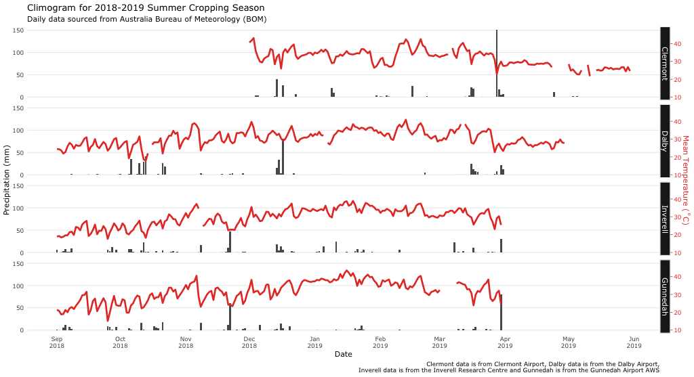

#### Package or resource used
[bomrang](https://docs.ropensci.org/bomrang/)

#### URL or code snippet for your use case
Full article: https://communities.grdc.com.au/field-crop-diseases/sorghum-disease-survey/

Code gist: https://gist.github.com/adamhsparks/23d6266f4a2b5f19f9edef6970f0364a

#### Image
 

#### Sector
academic

#### Field(s) of application 
botanical epidemiology, plant pathology, agronomy

#### What did you do? 
I used `bomrang`'s [`get_historical()`](https://docs.ropensci.org/bomrang/articles/bomrang.html#using-get_historical) to fetch weather data, rainfall and temperature, for four stations in Queensland and New South Wales to create a climogram to illustrate how rainfall seemingly affected the distribution of sorghum charcoal rot (_Macrophomina phaseolina_) during the summer season of 2018/19. The article was published online as a part of the [GRDC Communities Field Crops Diseases](https://communities.grdc.com.au/field-crop-diseases/) blog.

