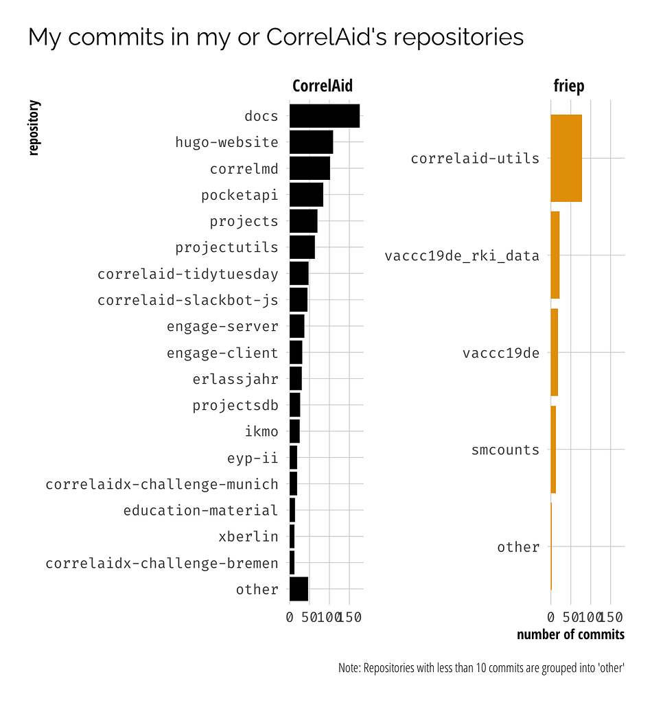

#### rOpenSci package or resource used
- [ghql](https://github.com/ropensci/ghql)

#### What did you do? 
I had a Twitter bot summarize my 2020 contributions on GitHub. I was a bit surprised by the high number of commits that I had made so I decided to have a look into that. I used the [GitHub GraphQL API](https://docs.github.com/en/graphql) via the ghql package to first pull all the repositories I had contributed to in the past and in a second step get all my commits to those repositories. I then had a look at the "smaller commits" to check whether "~30% of my commits were 1 line diffs" which was my main hypothesis for the high number of commits (spoiler: no, only ~12%). I also had a look at the files that I changed in those small commits (using the REST API via gh). 
In theory and with some tweaks (mostly adding pagination to the first step), the data collection approach via ghql should be able to give you _all_ your commits to the default branch over all repositories you have committed to. :exploding_head:

#### URL or code snippet for your use case*
- [Blog post](https://frie.codes/posts/analyzing-commits-graphql-r/)
- [Code](https://gitlab.com/friep/blog/-/blob/main/_posts/analyzing-commits-graphql-r/index.Rmd) (ironically on GitLab :slight_smile: )

For example, here's the query for step 2 (get all commits to a specific repo):

```
query getCommits($name: String!, $owner: String!, $authorId: String!, $after: String) 
  {
  repository(name: $name, owner: $owner) {
    defaultBranchRef {
      target { 
        ... on Commit {
          history(first: 100, author: {id: $authorId}, after: $after) {
           nodes {
              commitUrl
              deletions
              additions
              author {
                user {
                  login
                }
                email
                name
              }
              message
              messageBody
              changedFiles
              committedDate
              oid
              committedViaWeb
              pushedDate
           }
            
            pageInfo {
              hasNextPage
              hasPreviousPage
              endCursor
            }
            totalCount
          }
        }
      }
    }
  }
}
```

#### Image



#### Sector
other


#### Field(s) of application 
ehm. social sciences maybe? in general, meta analysis of your research patterns maybe?


