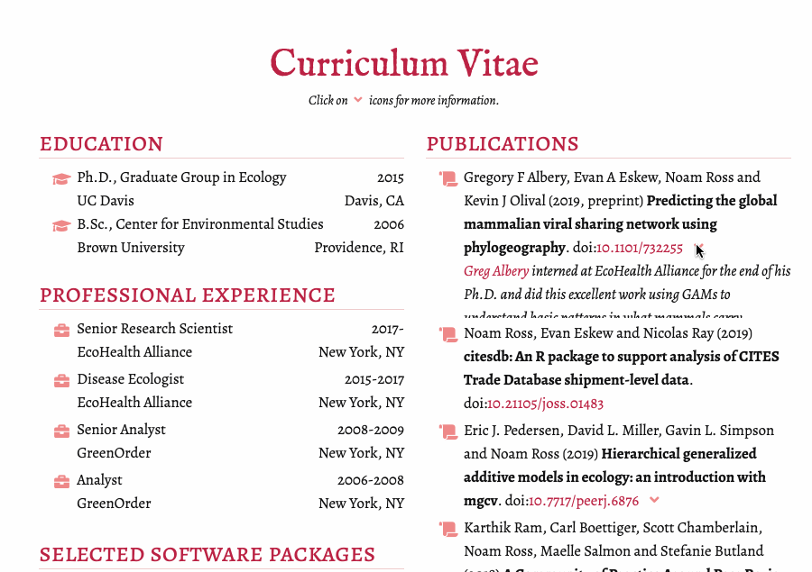

I use rOpenSci's **rorcid** package to generate my CV for my academic website.  Prior to building the website, I run a [script](https://github.com/noamross/noamross.net/blob/018ec3915dced73a7a66ea56d0ee270efc6e3bac/scripts/get-orcid-data.R) with rorcid that downloads my publications, education, and work history, combines them with some additional annotation data, and saves them as YAML files. These are used by the Hugo site generator to generate my CV.

#### Package or resource used*

**rorcid**: https://github.com/ropensci/rorcid

#### URL or code snippet for your use case

https://www.noamross.net/vitae/

#### Image

 

#### Sector

Academic

