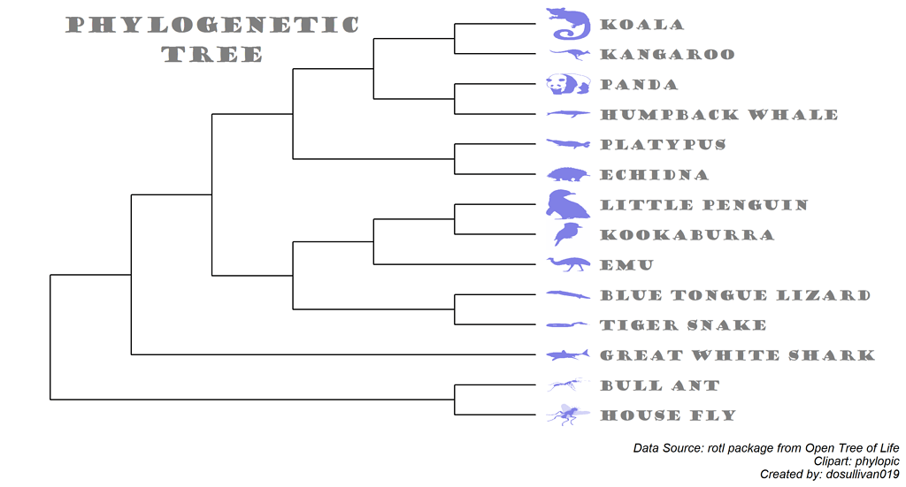

#### rOpenSci package or resource used*
[rotl](https://docs.ropensci.org/rotl/)

#### What did you do? 
Used rotl to create a phylogenetic tree using a species scientific name and included clipart for each animal using phylopic.

#### URL or code snippet for your use case*
https://github.com/dosullivan019/30DayChartChallenge/blob/e4f5fe3e9d6245a5a65b7d617c785781eaaa5b69/code/day16_tree.R

#### Image

#### Sector
other

