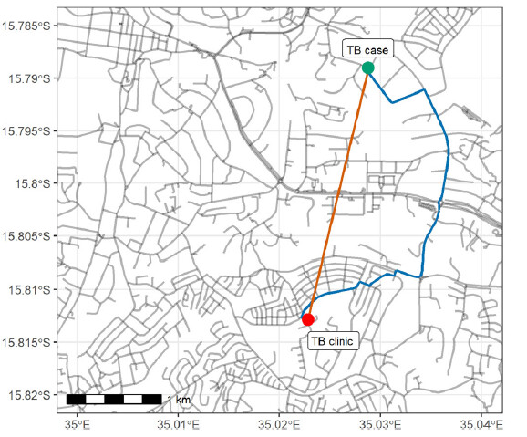

#### rOpenSci package or resource used*
  [stplanr](https://docs.ropensci.org/stplanr/)

#### What did you do? 

We estimated the distance from study participants’ (TB patients) households to their TB treatment initiation clinic using two approaches. The first approach was to estimate the distance based on a ‘straight line’ distance [Cartesian distance](https://en.wikipedia.org/wiki/Euclidean_distance). In the second approach, we used Blantyre urban road network downloaded from OpenStreetMap (OpenStreetMap Foundation) to calculate the shortest road network distance using the [stplanr R package](http://ropensci.discourse.group/t/use-stplanr-to-find-and-plot-major-streets-of-a-city/2264)

#### URL or code snippet for your use case*
[ Clinical, health systems and neighbourhood determinants of tuberculosis case fatality in urban Blantyre, Malawi: a multilevel epidemiological analysis of enhanced surveillance data](https://www.cambridge.org/core/journals/epidemiology-and-infection/article/clinical-health-systems-and-neighbourhood-determinants-of-tuberculosis-case-fatality-in-urban-blantyre-malawi-a-multilevel-epidemiological-analysis-of-enhanced-surveillance-data/F18F42BE454F5EAFDB2FDD27DDDACC1E#fig01)))

#### Image

#### Sector
Public health

#### Field(s) of application 
epidemiology 

