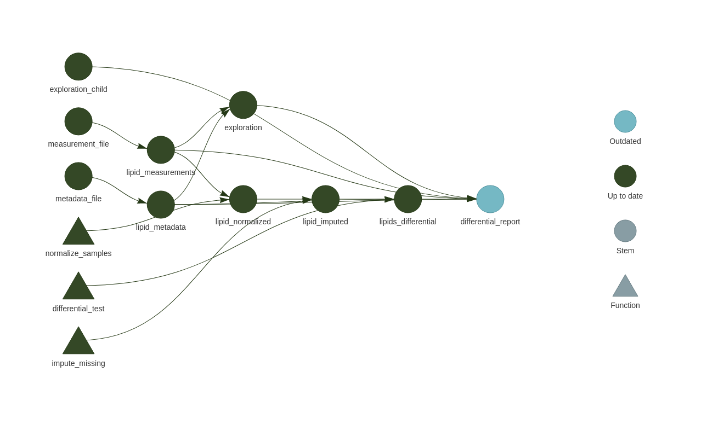

#### rOpenSci package or resource used

[targets](https://docs.ropensci.org/targets/)

#### What did you do?

I used targets to analyze and report on omics (metabolomics in this case) data analysis.

#### URL or code snippet for your use case*

[Blog post](https://rmflight.github.io/posts/2022-09-27-creating-an-analysis-using-targets/), [GitHub repository](https://github.com/rmflight/example_targets_workflow)

#### Image

#### Sector

academic

#### Field(s) of application 

biomedical research

#### Mastodon handle

`@rmflight@mastodon.social`

