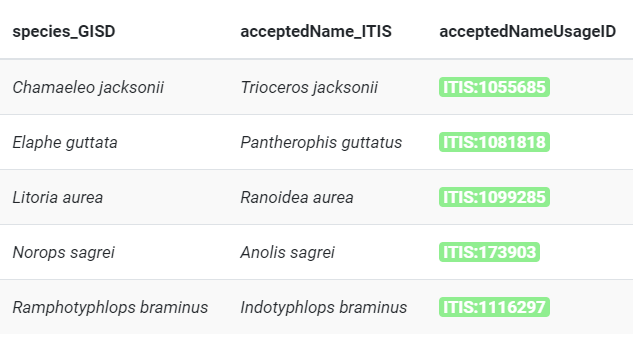

#### rOpenSci package or resource used*
[taxadb](https://docs.ropensci.org/taxadb/)

#### URL or code snippet for your use case*
https://gavinmasterson.netlify.app/post/taxadb/

#### Image
 

#### Sector
academic

#### Field(s) of application 
ecology, conservation, evolutionary biology, species distribution modeling

#### What did you do? 
I used the {taxadb} package to verify taxonomic information for two ecology-related projects. In the second case, I compared taxonomic identifications from 2006 with the current information for those species to identify changes in name and/or status..

