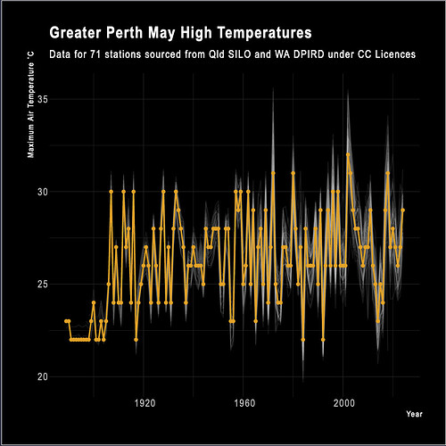

#### rOpenSci package or resource used

[{weatherOz}](https://docs.ropensci.org/weatherOz/)

#### What did you do? 

I used {weatherOz} to get weather data for the Perth metropolitan area and recreate a figure from an ABC article, sorta.

#### URL or code snippet for your use case*

https://adamhsparks.netlify.app/2024/06/02/plotting-perth-month-of-may-high-temperatures-with-weatheroz/

#### Image

#### Sector
Academic

#### Field(s) of application 
history, climate

#### Mastodon profile link 
@adamhsparks@rstats.me

