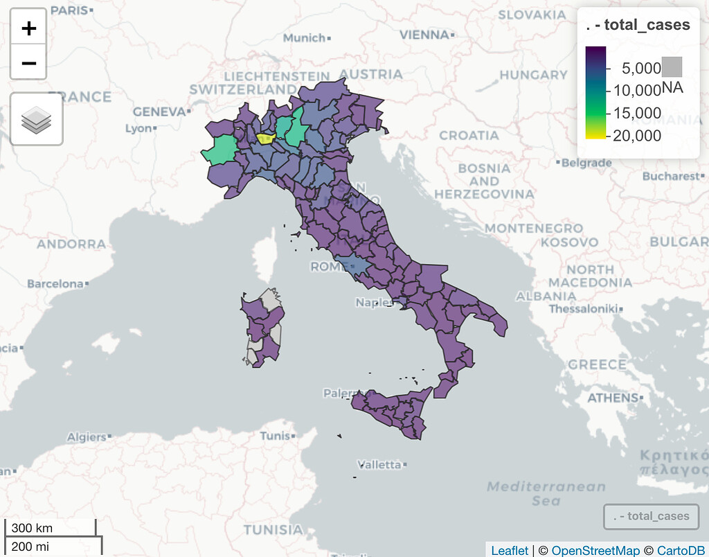

#### rOpenSci package or resource used*
rnaturalearth

#### What did you do? 

I created several R dataset packages for tracking the covid19 virus in different geographic locations (Italy, Switzerland, etc.). To help users create choropleth maps with a minimum effort I added for each dataset (when applicable) a column with the corresponding region/province naming convention used in the **rnaturaleath** package. The goal is to enable a seamless merge of the data with the geospatial data available in the package with the `ne_state` function.

For example, in the `italy_province` dataset from the [covid19italy](https://github.com/RamiKrispin/covid19Italy) package the `province_spatial` presents the corresponding province names used on the **rnaturalearth** package. Merge and plot of the covid19 cases with **rnaturalearth** and **mapview** is straightforward:

```
library(covid19italy)
library(rnaturalearth)
library(mapview)
library(dplyr)

data("italy_province")

ne_states(country = "Italy", returnclass = "sf") %>% 
  select(province = name, region, geometry)  %>%
  left_join(italy_province %>% 
              filter(date == max(date)), # subseting for the most recent day
            by = c("province" = "province_spatial")) %>%
  mapview(zcol = "total_cases")
```

 

More information about the use cases of the **rnaturalearth** with covid19 dataset available on the following vignettes:

**covid19italy** package - https://covid19r.github.io/covid19italy/articles/geospatial_visualization.html
**covid19swiss** package - https://covid19r.github.io/covid19swiss/articles/spatial_dataviz.html
Italy covid19 dashboard - https://ramikrispin.github.io/italy_dash/#summary


