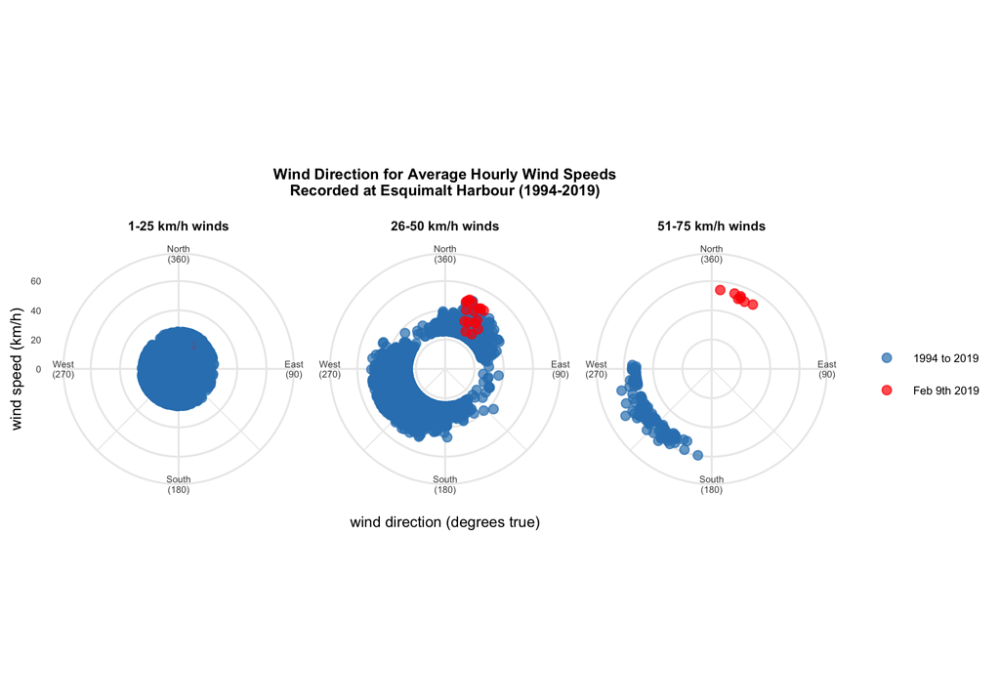

#### rOpenSci Package used
[weathercan](https://ropensci.github.io/weathercan/)

#### Use Case -- Blog Posts in GitHub
[Weather with `weathercan`](https://github.com/stephhazlitt/some-assembly-required/blob/1eec5cc92cf7fd7b69d24d47cc52c0bd0a9a9e0b/R/fence/fence.md)
_and_
[When You Miss the Target](https://github.com/stephhazlitt/some-assembly-required/blob/1eec5cc92cf7fd7b69d24d47cc52c0bd0a9a9e0b/R/fence/wind_direction.md)
_and_
[a script with a final, better datavis option](https://github.com/stephhazlitt/some-assembly-required/blob/1eec5cc92cf7fd7b69d24d47cc52c0bd0a9a9e0b/R/fence/wind_coord.R)

#### Images
 

